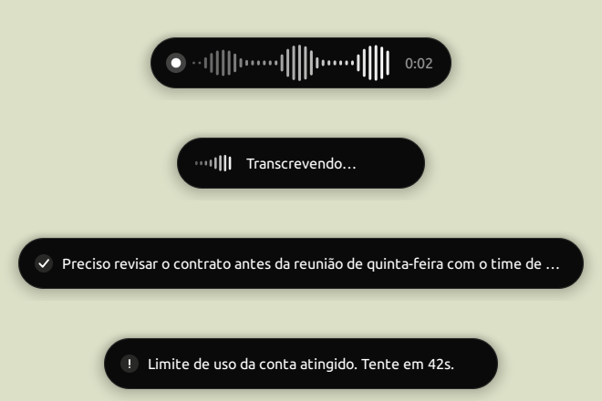

# Sussurro

Ditado por voz global para Linux/X11. Segure **Pause/Break**, fale, solte — o áudio vai
para o Whisper (na Groq ou num servidor seu) e o texto volta colado onde o cursor
estiver.



## Como funciona

1. **Segure a tecla** — o Sussurro intercepta só essa tecla (`XGrabKey`), nunca o resto
   do teclado, e começa a gravar pelo PipeWire em 16 kHz mono.
2. **Fale** — a cápsula flutuante mostra o nível do microfone e o tempo decorrido.
   `Esc` cancela sem enviar nada.
3. **Solte** — o áudio vira WAV em memória e sobe para o serviço configurado: a Groq
   (`api.groq.com`) ou um servidor próprio compatível com a API da OpenAI.
4. **Pronto** — o texto vai para a área de transferência e é colado na janela ativa:
   `Ctrl+V`, ou `Ctrl+Shift+V` quando o que está em foco é um terminal.

O áudio nunca toca o disco: existe só na memória e é descartado depois do envio. O que
fica salvo é o texto, no histórico local — e isso pode ser desligado.

## Instalação

```bash
git clone https://github.com/DanielFreitasDev/sussurro.git
cd sussurro
./install.sh
```

O script cria o ambiente virtual, instala o lançador em `~/.local/bin/sussurro`, registra
o ícone e pergunta se deve iniciar junto com a sessão — use `--autostart` ou
`--no-autostart` para rodar sem perguntas.

Na primeira execução a janela de configurações abre sozinha: cole a chave criada em
[console.groq.com/keys](https://console.groq.com/keys) e clique em **Testar**. Se a
variável `GROQ_API_KEY` existir no ambiente, ela tem prioridade sobre a chave salva.
Quem prefere não depender da nuvem escolhe **Servidor próprio** — veja abaixo.

## Requisitos

- Sessão **X11** (KDE, GNOME, XFCE…) ou **Wayland no KDE Plasma 6** — veja a nota abaixo.
- **PipeWire** com `pw-record` (pacote `pipewire-bin`).
- **Python 3.11+**.
- No X11, só para o modo *digitar caractere a caractere*: `ydotool` com o serviço
  `ydotoold` ativo. No Wayland esse modo não precisa de nada além do próprio Sussurro.

### No Wayland (KDE Plasma 6)

No Wayland o compositor é o dono do teclado, então o Sussurro pede duas coisas ao
sistema, ambas sem `sudo` e sem afrouxar a segurança do desktop:

- **O atalho** é registrado no serviço de atalhos do Plasma, o mesmo dos atalhos do
  sistema — ele aparece em *Configurações do Sistema → Atalhos*, como o de qualquer
  aplicativo do KDE.
- **A colagem** passa pelo portal do sistema. Na primeira execução aparece um pedido de
  permissão para controlar a entrada; autorize (marcando *lembrar*, se houver) e ele não
  volta a aparecer.

Duas diferenças em relação ao X11: as teclas oferecidas são só as que o Plasma aceita
como atalho (Pause, Scroll Lock, Menu, F13, F14, Insert — modificadoras sozinhas ficam
de fora), e o modo *Automático* de colagem não detecta terminais, porque o Wayland não
revela qual janela está em foco. Quem dita em terminal deve escolher **Ctrl + Shift + V**
nas configurações. Outros ambientes Wayland (GNOME, Sway) ainda não são suportados.

Em rede com proxy não é preciso configurar nada: o Sussurro usa as variáveis
`http(s)_proxy` quando existem e, se não existirem — o caso de quem é iniciado pela
sessão gráfica —, lê o proxy configurado no sistema. O campo *Proxy* nas configurações
força um endereço específico.

## Configurações

| Ajuste | O que faz |
| --- | --- |
| **Serviço** | Groq (nuvem) ou um servidor próprio compatível com a API da OpenAI |
| **Modelo** | `whisper-large-v3-turbo` (padrão) ou `whisper-large-v3` |
| **Idioma** | Fixar o idioma acelera e evita traduções acidentais |
| **Vocabulário** | Nomes e siglas que o modelo costuma errar (limite de 224 tokens) |
| **Tecla de ditado** | Pause, Scroll Lock, Menu, F13, F14, Insert (no X11, também Ctrl/Alt/Super direitos) |
| **Microfone** | Qualquer fonte do PipeWire, ou a padrão do sistema |
| **Como entregar o texto** | Automático, Ctrl+V, Ctrl+Shift+V, Shift+Insert, digitar, ou só copiar |
| **Tema** | Acompanha o sistema, ou fixo em escuro/claro |
| **Ao concluir** | Mostrar o texto, apenas um ✓, ou nada — colar direto |
| **Posição do indicador** | Rodapé ou topo da tela |
| **Histórico** | Guarda as últimas transcrições, acessíveis pela bandeja |

As preferências ficam em `~/.config/sussurro/config.json` (permissão `600`, porque guarda
a chave) e o histórico em `~/.local/share/sussurro/history.jsonl`. Três ajustes finos
existem só no JSON: `min_duration` (0,45 s de tecla segurada — abaixo disso o toque é
ignorado),
`max_duration` (300 s — encerra a gravação sozinho) e `temperature`.

O ícone na bandeja também grava sem o teclado (útil para trechos longos), copia do
histórico, desliga o atalho temporariamente e encerra o aplicativo.

### Servidor próprio

Além da Groq, o Sussurro fala com qualquer serviço que implemente
`POST /v1/audio/transcriptions` no formato da OpenAI — um
[whisper-turbo-api](https://github.com/DanielFreitasDev/whisper-turbo-api) com
faster-whisper na sua GPU, por exemplo. Escolha **Servidor próprio** em *Serviço de transcrição*, informe o
endereço (aceita com ou sem `/v1` no fim, e assume `https://` se faltar o esquema) e a
chave que esse servidor exige. As chaves da Groq e do servidor são guardadas
separadamente: alternar entre os serviços não apaga nenhuma das duas. O modelo
selecionado é enviado como está — se o servidor não o tiver, o erro dele aparece na
cápsula.

## Interface

Monocromática e colada ao tema do sistema: preto com texto branco no escuro, branco com
texto preto no claro, trocando na hora. A janela de configurações não usa a moldura do
sistema — arraste pelo cabeçalho, feche com `Esc`.

Os seletores ignoram a roda do mouse de propósito: rolar a página nunca altera um ajuste.
Botões e barra de rolagem são pintados à mão para poderem animar, já que folhas de estilo
do Qt não têm transição.

## Solução de problemas

**"A tecla já está reservada por outro programa"** — outro aplicativo ficou com ela.
Escolha outro atalho nas configurações, ou libere a tecla em
*Configurações do Sistema → Atalhos*.

**No Wayland: "Permissão de controle do teclado negada"** — o pedido do portal foi
recusado, então o texto é apenas copiado. Para pedir de novo, encerre e reabra o
Sussurro; se o KDE tiver guardado a recusa, revise-a em *Configurações do Sistema →
Aplicativos → Permissões de aplicativos*.

**"Nenhum som captado"** — o microfone escolhido está mudo ou é o dispositivo errado.
Confira em *Microfone*, ou rode `wpctl status`.

**O texto é copiado mas não colado** — alguns aplicativos ignoram colagens sintéticas.
Troque *Como entregar o texto* para **Digitar caractere a caractere** (precisa do
`ydotoold` ativo) ou para **Apenas copiar**.

**Nada acontece ao segurar a tecla** — veja se o processo está vivo com
`pgrep -af sussurro` e rode `sussurro` num terminal para ver os erros. No Wayland,
confira também se a tecla aparece para o Sussurro em *Configurações do Sistema →
Atalhos*.

**"Sem acesso a api.groq.com"** — típico de rede com proxy. Funciona no terminal e falha
quando inicia com a sessão? É porque o proxy só existe nas variáveis do shell. Preencha o
campo *Proxy* nas configurações, ou configure o proxy do sistema — o Sussurro lê os dois.

## Desenvolvimento

```bash
PYTHONPATH=. .venv/bin/python -m sussurro           # executa
PYTHONPATH=. .venv/bin/python tools/preview.py ok   # rec | work | ok | check | err | info
.venv/bin/python -m pyflakes sussurro/*.py          # lint
```

Arquitetura e armadilhas do stack estão em [CLAUDE.md](CLAUDE.md); o diário técnico
do projeto, com os porquês e as medições, em [LEARNING.md](LEARNING.md).

## Licença

MIT — veja [LICENSE](LICENSE).
